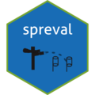
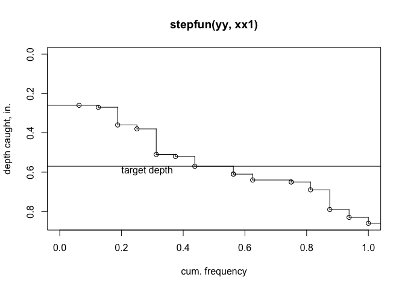

# spreval 

<!-- README.md is generated from README.Rmd. Please edit that file -->

# Evaluation of Sprinkler Irrigation Uniformity and Efficiency

<!-- badges: start -->
<!-- badges: end -->

## Brief Description of spreval package

The `spreval` package contains a number of functions to assess
irrigation sprinkler system application uniformity and efficiency. Use
of the functions allow for assessment of lateral-move, solid-set, and
hose pull (big gun) irrigation systems.

`spreval::catchcan` is a data file included in this package. Methods
implemented in this package and data used in the vignettes are taken
from the references below:

## References

Christiansen, J.D. 1942. Irrigation by Sprinkling. California
Agricultural Experiment Station Bulletin 670. <ISBN:0138779295>

Evans, R.O., Barker J.C., Smith J.T., Sheffield R.E. 1997b. Field
calibration procedures for animal wastewater application equipment, hard
hose and cable tow traveler irrigation system. NC Cooperative Extension
Service publication AG-553-2. Raleigh, NC.
(<https://content.ces.ncsu.edu/hard-hose-and-cable-tow-traveler-irrigation-systems>)

Evans, R.O., Barker J.C., Smith J.T., Sheffield R.E. 1997a. Field
calibration procedures for animal wastewater application equipment,
stationary sprinkler irrigation system. NC Cooperative Extension Service
publication AG 553-1. Raleigh, NC.
(<https://irrigation.wordpress.ncsu.edu/files/2017/01/ag-553-1-stationary-sprinkler.pdf>)

Mirriam and Keller, 1978. Farm System Irrigation Evaluation: A Guide for
Management. Form II-1, item 10, p.29. Utah State University, Logan,
Utah. (<https://pdf.usaid.gov/pdf_docs/PNAAG745.pdf>)

## Installation

You can install the released version of spreval (date TBD) from
[CRAN](https://CRAN.R-project.org) with:

``` r
install.packages("spreval")
```

a “pre-CRAN” development package is available at: [package in
github](https://github.com/glgrabow/spreval/blob/master/packages/spreval_0.1.0.900.tar.gz)
This may be installed as an archive file locally on your machine after
downloading.

A pdf file documenting all of the package functions is available at:
[here](https://github.com/glgrabow/spreval/blob/master/docs/spreval.pdf)

Check the changelog tab for updates on version history.

## Example

A quick example of a couple of things this package will do is shown
below. In this example, conventional statistics, e.g., `CU`, `DU`, DU
low half (`DU.lh`), and `PELQ` are computed. Additionally, a cumulative
distribution plot of the data are shown with a target depth (`sfplot`)
to help visualize the relative area receiving less than or more than the
target depth, and the deviation from the target depth is shown. For
perspective, the top of the plot can be considered as the soil surface
and the cumulative distribution line the depth of catch:

``` r
library(spreval)
## basic example code
data("catchcan")
cc.data<-catchcan$solid.set #fetch solid set data
ss.uni<-c(CU(cc.data),DU(cc.data),DU.lh(cc.data),PELQ(cc.data,SI=FALSE,rate=16.98,ss=80,sl=80,dur=2.25))# use U.S. cust. units
table<-round(ss.uni,0)
knitr::kable(t(table),col.names=c("CU","DU","DU.lh","PELQ"))#transpose array (table) for display
```

|  CU |  DU | DU.lh | PELQ |
|----:|----:|------:|-----:|
|  75 |  55 |    76 |   55 |

``` r
sfplot(as.vector(cc.data),target=0.57,ylab="depth caught, in.")
```


